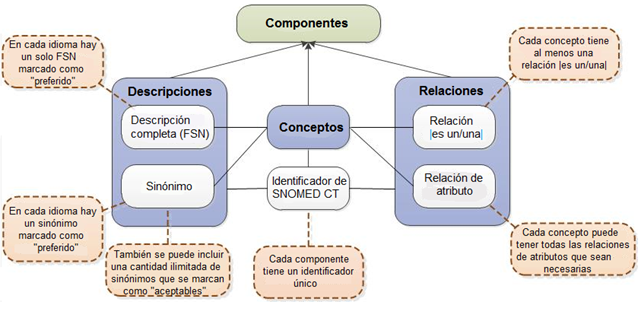
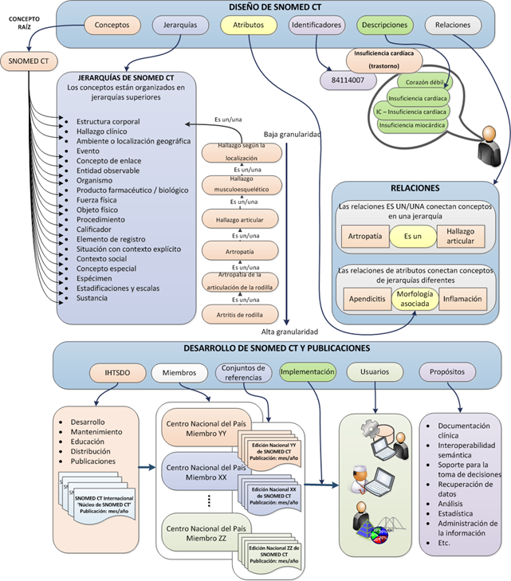
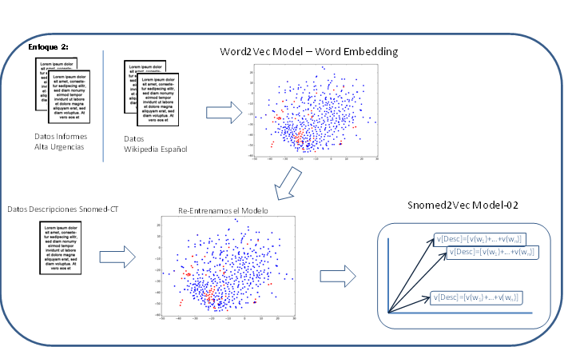
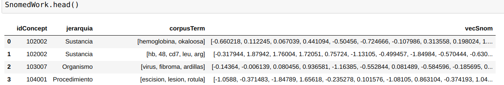

# Snomed2Vec - Use Model - Methods & Class. 
## A new Approach Snomed-CT with word embedding - Snomed2Vec - Model.
### Introducción:
**Autor:** Ignacio Martinez Soriano.<br>
**Director Tesis:** Juan Luis Castro Peña.<br>
**Fecha:** 16/12/2018.<br>

## 1. Introducción:
Creación de un nuevo enfoque **Snomed2Vec**<br>
Diseño de una herramienta para obtener los conceptos clínicos dentro del texto libre de cualquier informe médico. Asociándole el código mas aproximado, del concepto Snomed-CT. Devolviendo la lista de conceptos Snomed-CT, que aparecen en una frase y sus relaciones con otras entidadades clínicas.<br>
Nos basamos en dos artículos:<br>
1. [DNER Clinical (named entity recognition) from free clinical text to Snomed-CT concept](http://www.wseas.org/multimedia/journals/computers/2017/a205805-078.pdf). Ignacio Martinez Soriano. Juan Luis castro Peña. WSEAS Transactions on Computers, ISSN / E-ISSN: 1109-2750 / 2224-2872, Volume 16, 2017, Art. 10, pp. 83-91.
1. [STMC: Semantic Tag Medical Concept Using Word2Vec Representation](https://ieeexplore.ieee.org/document/8417270) Ignacio Martinez Soriano, Juan Luis Castro Peña. 2018 IEEE 31st International Symposium on Computer-Based Medical Systems (CBMS). Karsltad (Sweden).


Desarrollo de un **Clinical Semantic TAG** (Clinical Named Entity Recognition - NER).<br>
Generamos un espacio vectorial de palabras embebidas, "Word Embedding", utilizamos un enfoque híbrido con dos versiones, creando distintos enfoques:
* los Informes de Alta del Servicio de Urgencias del Hospital "Rafael Méndez", desde el año 2009-2016, mas las descripciones de los conceptos de Snomed-CT.
* Un modelo genarado con la descarga normalizada de Wikipedia en español (Fecha 01 de Octubre 2018) + las descripciones de los conceptos de Snomed.CT.

Para generar el espacio vectorial final de palabras embebidas, utilizamos nuestro modelo entrenado con las palabras de un gran corpus (Informes de Alta o Wikipedia) y lo volvemos a entrenar añadiendole las descripciones de Snomed-CT, generando de esta forma los vectores finales de nuestro Modelo.

**Generación Modelo final Snomed2Vec:**

Basándonos en los vectores de ese Modelo, aplicamos los vectores de las palabras para generar el Vector de la Descripción de Snomed-CT:<br>
Utilizamos el Modelo generado con Word2Vec, y lo aplicamos a la descripción de Snomed-CT, generando el siguiente vector asociado a la descripción **[d]**<br>
Siendo $ V(w_i) $ el Vector asociado a la palabra $ w_i $, según el modelo Word2Vec $ M $.<br>
* $ Descripcion-Snomed-CT(d) = (w_1,w_2,...,w_n),=> V[d] = \sum_{i=1}^{n}v[w_{i}]=v[w_{1}]+v[w_{2}]+...+v[w_{n}] $

El Modelo **Snomed2Vec** final: quedaria así:

* Un registro para cada concepto con la siguiente estructura:<br>
**| Id-Concept | Jerarquia | Descripcion | [Vector de la Descripción] |**

### Métodos implementados:

Implementamos una version de **Most_Similar()** para obtener los Conceptos similares de  **Snomed-CT**<br>

* **Mas_Similar('frase','clase mas proxima')**
*  Entrada: **frase**, **clase mas proxima**, se refiere a si se quiere buscar, los conceptos mas cercanos, según la jerarquía de Snomed-CT.
*  Salida: (Lista de conceptos, nombrados en la **frase**, proporcionando los mas cercanos según clase buscada)

## 2. Snomed-CT:
Utilizamos la Ontología **Snomed-CT**, como Terminología clínica,para identificar los conceptos y codificarlos.<br>

### Estructura Lógica:

*Imagen de https://confluence.ihtsdotools.org/*

**Conceptos:**<br>
Cada concepto representa un significado clínico único, al que se referencia con un identificador numérico único de SNOMED CT.

**Descripciones:**<br>
A cada concepto se asigna un conjunto de descripciones textuales. Éstas constituyen la forma legible de un concepto. Se utilizan dos tipos de descripciones para representar cada concepto - Descripción completa (FSN, por Fully specified name en inglés) y Sinónimo.

**Relaciones:**<br>
Una relación representa una asociación entre dos conceptos. Las relaciones se utilizan para definir lógicamente el significado de un concepto de manera que pueda procesarlo un ordenador. Un tercer concepto, denominado el tipo de relación (o atributo), se utiliza para representar el significado de la asociación entre el concepto de origen y el de destino. En SNOMED CT existen diferentes tipos de relaciones.

**Jerarquías:**<br>
Nivel superior con una breve descripción del contenido representado en su rama de la jerarquía.

>**|Hallazgo clínico|** representa el resultado de una observación, una evaluación o un juicio clínico e incluye a los conceptos utilizados para representar diagnósticos.<br>
**|Procedimiento|** representa actividades que se llevan a cabo durante la atención de la salud.<br>
**|Situación con contexto explícito|** representa hallazgos clínicos y procedimientos que aún no han ocurrido, (por ejemplo,|antecedente de infarto de miocardio|).<br>
**|Entidad observable|** representa una pregunta o una evaluación de las que se puede obtener una respuesta o un resultado (por ejemplo, |presión arterial sistólica|, |color del iris|, |género|). <br>
**|Estructura corporal|** representa estructuras anatómicas normales y anormales.<br>
**|Organismo|** representa organismos relevantes para la medicina humana y veterinaria.<br>
**|Sustancia|** representa sustancias en general, los constituyentes químicos de los productos farmacéuticos/biológicos, sustancias corporales, sustancias alimenticias y diagnósticas. <br>
**|Producto farmacéutico / biológico|** representa los productos farmacológicos (por ejemplo, |amoxicilina 250 mg, cápsula|, |paracetamol + codeína comprimido|). <br>
**|Espécimen|** representa entidades que se obtienen (por lo general del paciente) para realizar exámenes o análisis.<br>
**|Concepto especial|** representa conceptos que no desempeñan ningún papel en la lógica formal del modelo conceptual de la terminología, pero que pueden ser útiles para casos de uso específicos. <br>
**|Objeto físico|** representa objetos físicos naturales y fabricados por el hombre.<br>
**|Fuerza física|** representa fuerzas físicas que pueden desempeñar un papel como mecanismos de lesión (por ejemplo |fricción|, |radiación|, |corriente alterna|).<br>
**|Evento|** representa acontecimientos, con exclusión de procedimientos e intervenciones, (por ejemplo, |terremoto|). <br>
**|Ambiente o localización geográfica|** representa tipos de ambientes, así como lugares con nombres propios, como países, estados y regiones.<br>
**|Contexto social|** representa condiciones sociales y circunstancias significativas para la atención de la salud.<br>
**|Estadificaciones y escalas|** representa escalas de evaluación y sistemas de estadificación tumoral. <br>
**|Calificador|** representa los valores para algunos de los atributos de SNOMED CT, cuando esos valores no son subtipos de otros conceptos de nivel superior (por ejemplo, |izquierdo|, |resultado anormal|, |severo|).<br>
**|Elemento de registro|** representa contenido creado para brindar información a otras personas sobre eventos de registro o estado de asuntos (por ejemplo, |registro llevado por el paciente|, entrada de registro|, |sección correspondiente a antecedentes familiares|).<br>
**|Componente del modelo de SNOMED CT|** contiene los metadatos que se utilizan para la publicación de SNOMED CT. <br>


### Estructura General:

*Imagen de https://confluence.ihtsdotools.org/*

## 3. Generación de los Modelos de Espacio Vectorial, para palabras:

Para generar el modelo vectorial de palabras embebidas utilizamos Word2Vec, generado por Mikolov et al.<br>
>Tomas Mikolov, Kai Chen, Greg Corrado, and Jeffrey Dean. 2013a. [Efficient estimation of word representations in vector space.](https://arxiv.org/abs/1301.3781) In Proceedings of ICLR Workshop


**Word2Vec**, es un framework semántico que utiliza una red neuronal superficial de una sola capa oculta, para aprender la representación de la palabra según su contexto.<br>
La idea es que el significado de las palabras viene definido, por el contexto. Esta idea fue desarrollada por Mikolov et al. generando una representacion distribuida de palabras en un espacio vectorial. Permitiendo la agrupación de palabras similares.
Para generar los Modelos del espacio vectorial de palabras, utilizamos la libreria Python **gensim:**<br>
>[*REHUREK, R., AND SOJKA, P. Software framework for topic modelling with large corpora. New Challenges For NLP Frameworks Programme (May 2010), 45–50.*](https://github.com/RaRe-Technologies/gensim)

Los parámetros utilizados para entrenar la red neuronal, han sido:
* El modelo elegido ha sido Skip-Gram.
* Tamaño del vector. size=300.
* Tamaño del a ventana de contexto. Window=5
* Mínimas palabras de estudio. min_count=2

**Se ha generado los siguientes Modelos:**

1. Modelo Dominio local, Word2Vec: Snomed2Vec-IA<br>
Se genera un modelo de espacio vectorial, con **Word2Vec**, basado en los **Informes de Alta de urgencias**. Con los siguientes parámetros:<br>
***(SkipGram, vector size 300, windows= 5, Negative=0, min=2)***

1. Modelo Dominio General, Word2Vec: Snomed2Vec-Wiki<br>
Se genera un modelo de espacio vectorial, con **Word2Vec**, basado en **Wikipedia Español**. Con los siguientes parámetros:<br>
***(SkipGram, vector size 300, windows= 5, Negative=0, min=2)***

1. Modelo Dominio General, Word2Vec: Snomed2Vec-CT<br>
Se genera un modelo de espacio vectorial, con **Word2Vec**, basado en **Descripciones del Snomed-CT**. Con los siguientes parámetros:<br>
***(SkipGram, vector size 300, windows= 5, Negative=0, min=2)***

1. Modelo Dominio local, ampliado con las descripciones de Snomed-CT:<br>
Se genera un modelo de espacio vectorial, con **Word2Vec**, basado en los Informes de Alta de urgencias y se vuelve a entrenar con las descripciones de Snomed-CT.

1. Modelo Dominio general, Wikipedia, ampliado con descripciones Snomed-CT:<br>
Se genera un modelo de espacio vectorial, con **Word2Vec**, basado en los datos de la wikipedia en español, ampliada con las descripciones de Snomed-CT.

**Modelo Final:**


## 4. Generación Vector para las frases:

Una vez generado el modelo elegido, se aplica a las descripciones de Snomed-CT, utilizando un DataSet construido específicamente para este framework.

El DataSet construido está compuesto por los siguientes campos **(id-Concepto, Jerarquia, descripción Concepto)**
Para identificar que tipo de concepto estamos seleccionando, se ha utilizado la jerarquia superior del concepto de Snomed-CT, al que pertenece.

**Generación Modelo final:**<br>
Utillizando los modelos anteriores, se aplica a la descripción del concepto, para generar el vector de la descripción:

Siendo $ V(w_i) $ el Vector asociado a la palabra $ w_i $, según el modelo Word2Vec $ M $.<br>
* $ Descripcion-Snomed-CT(d) = (w_1,w_2,...,w_n),=> V[d] = \sum_{i=1}^{n}v[w_{i}]=v[w_{1}]+v[w_{2}]+...+v[w_{n}] $

Obteniendo un modelo final **Snomed2Vec**, compuesto por:
**(id-Concept | Jerarquia | Descripción | vecSnom(d) )**:



## 5. Métodos,  cálculo similaridad y mas_similar():<br>
Para calcular los conceptos similares, se aplica la distancia del coseno, entre los vectores de cada palabra o frase:<br>


### Snomed2Vec.Similar(texto1, texto2):<br>
**Entrada:** texto1=frase secuencia palabras<br>
**Sallida:** grado de similaridad = distancia del coseno, entre los vectores de V[texto1] y v[texto2]<br>

### Snomed2Vec.mas_similar(texto,clase):<br>
**Entrada:**<br>
*texto*=frase secuencia palabras<br>
*clase*= Tipo de concepto, para sacar los más proximos, respecto a la entrad de texto.<br>
**Sallida:** grado de similaridad = distancia del coseno, entre los vectores de V[texto] y v[Todas Desc Snomed-CT]<br>


## 6. Resultados de la investigación:
* DataSet de Snomed-CT, compuesto por los conceptos con su jerarquia superior, y sus sinónimos.
* Modelo Wikipedia en Español, entrenado con word2vec y normalizado. (palabras en minúsculas). Tamañao 300 y con Skip-Gram.
* Modelos Snomed2Vec, entrenados, según lso modelos de espacios vectorial, elegidos.
* framework, para obtner los conceptos y relaciones, según una frase de entrada. (Por ejemplo un diagnóstico principal).


  
### Representation Learning
I create some jupyter notebook to test the framewotk
Prueba
  ```
  python Snomed2Vec.py *"sentence test"*
  ```
  This script get the SNomed-CT Clinical concept from a free text sentence. 

## 7. Data sources, Space vector Models:
** Corpus Gold:**

## Final notes:
This documentation is part of my PH.D.Thesis and share to improve this new approach.
For any comments or help needed with how to test *Snomed2Vec* tool, you can write to: ignacio.martinez@carm.es

